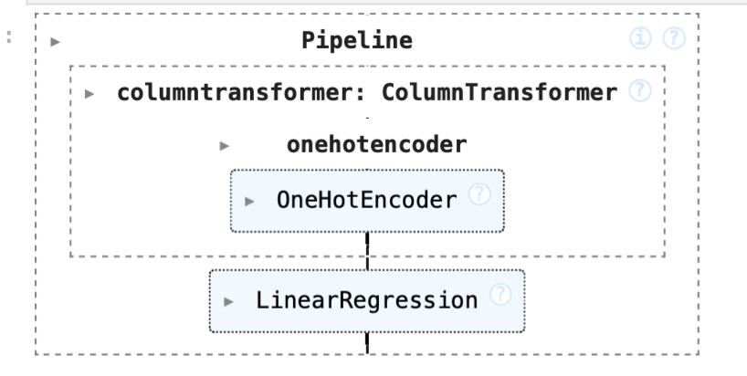
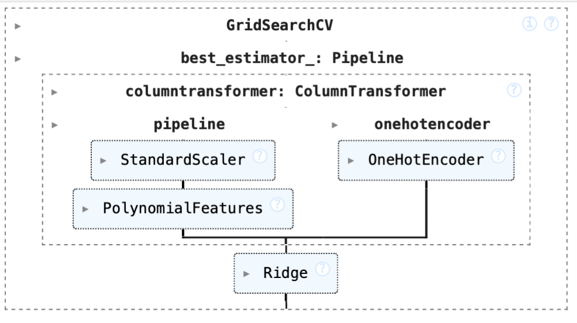

# Analysis of Homocysteine as a Biomarker for Cardiovascular Disease Among Non-Smokers
By Amber Campbell
## Introduction
### General Introduction
Cardiovascular disease has been the leading cause of death for both men and women in the United States since 1950. There are many known risk factors for cardiovascular disease including high blood pressure, high cholesterol, and smoking. Homocysteine, a naturally-occuring amino acid in the body, is often used as a biomarker for cardiovascular disease. While homocysteine is broken down by folate, Vitamin B12, and Vitamin B6 to generate chemicals the body needs, high levels of homocysteine can damange artery linings in the body and blood clots, significantly increasing the risk of cardiovascular disease. Research has long supported the notion of homocysteine as a biomarker for cardiovascular disease, and recent advocates support the use of its monitoring and measurement as a guide for disease prevention([PubMed Abstract](https://pubmed.ncbi.nlm.nih.gov/33660358/), [Cleveland Clinic](https://my.clevelandclinic.org/health/articles/21527-homocysteine)). 

The dataset I am using comes from the National Health and Nutrition Examination Survey (NHANES) 2005-2006 cohort study, in which demographic, socioeconomic, dietary, and health-related questions are collected from a nationally representative sample. Because smoking is such a well-identified risk factor for cardiovascular disease, the qustion I am intending to focus on is how demographic and health factors relate to a person's homocysteine levels, including diet quality, BMI, sex, race, blood pressure, and total cholesterol. Using such information, I created several prediction models to to predict a person's homocysteine level vased on these metrics. Such a prediction model can be used as an investigative tool for the risks of cardiovascular disease, with homocysteine serving as a proxy measure of an individual's risk for cardiovascular disease. 

### Introduction of Columns
 This dataset was prefiltered in attempts to only include non-smokers by excluding any persons who had smoked over 100 cigarettes in their lifetime or had smoked within 5 days of taking the survey. There are 2033 rows in this dataset, representing health and demographic information for 2033 participants of the NHANES survey. The dataset contains the following relevant columns: 

| Column                      | Description                                                         |
|-----------------------------|---------------------------------------------------------------------|
| `id` (SEQN)                 | Participants sequence number in NHANES study                        |
| `homocysteine` (LBXHCY)     | Homocysteine measurement (umol/L)                                   |
| `cotinine` (LBXCOT)         | Cotinine measurement - biomarker for tobacco smoke exposure (ng/mL) |
| `sex` (RIAGENDR)            | Sex (Male, Female)                                                  |
| `age` (RIDAGEYR)            | Age (years)                                                         |
| `race` (RIDRETH1)           | Race                                                                |
| `education_level` (DMDEDUC2)| Highest Education Achieved (No/Some/All High School, Some/All College)      |
| `bmi` (BMXBMI)              | BMI (kg/b^2^)                                                       |
| `diet_level` (DBQ700)       | Self-desribed Diet Quality (Poor, Fair, Good, Very Good, Excellent) |
| `WkAlcDays`                 | Average number of alcoholic drinks per week                         |
| `diabetes_status` (DIQ010)  | Diabetes Status (Borderline, Yes, No)                               |
| `systolic_bp` (BPXSY1)      | Systolic Blood Pressure (mmHg)                                      |
| `cholesterol` (LBXTC)       | Total Cholesterol (mg/dL)                                           |

## Data Cleaning and Exploratory Analysis
### Data Cleaning
 1. I started by renaming the columns (indicated in parentheses in the previous table) to be more easily-comprehendable. 
 2. I then verified that each row in the dataset had a unique ID, and thus no duplicate information about each participant from the study. I then checked relevant columns `homocysteine`, `age`, `bmi`, `systolic_bp`, and `cholesterol` for values of 0, which are likely indicators of missing values, because they are all measurements that should have values above 0. While none of these columns had values of 0, I noticed some extreme values for BMI (such as 130). While acknowledging that BMI is a controversial and more recently viewed as a misused or inaccurate measurement, it is highly unlikely for BMI values to be above 50, and I those chose to remove any rows from the dataset that contained BMI measurements over 54 after looking into this more ([CDC](https://www.nhlbi.nih.gov/health/educational/lose_wt/BMI/bmi_tbl.pdf), [Cleveland Clinic](https://my.clevelandclinic.org/health/diseases/21989-class-iii-obesity-formerly-known-as-morbid-obesity)). 
 3. I then inspected the categorial columns, making sure that the unique values in each column were comprehendable. The `diabetes_status` column had a range of values including 'Yes', 'No', 'Borderline', and 'Borderlinederline'. I corrected any instances of 'Borderlinederline' to match 'Borderline'.

My resulting dataframe contained 1099 rows. 
The first few rows of this cleaned dataset are shown below. 

|    id |   homocysteine |   cotinine | sex    |   age | race          | education_level   |   bmi | diet_level   | diabetes_status   |   systolic_bp |   cholesterol |   WkAlcDays |
|------:|---------------:|-----------:|:-------|------:|:--------------|:------------------|------:|:-------------|:------------------|--------------:|--------------:|------------:|
| 31131 |           9.33 |      0.035 | Female |    44 | Black         | SomeCollege       | 30.9  | Good         | No                |           144 |           105 |           0 |
| 31132 |           8.96 |      0.021 | Male   |    70 | White         | College           | 24.74 | VeryGood     | Yes               |           138 |           147 |           4 |
| 31134 |           8.2  |      0.065 | Male   |    73 | White         | HighSchool        | 30.63 | Good         | No                |           130 |           186 |           2 |
| 31144 |           7.97 |      0.125 | Male   |    21 | OtherHispanic | HighSchool        | 25.03 | Excellent    | No                |           116 |           207 |           0 |
| 31149 |          10.29 |      0.011 | Female |    85 | White         | SomeHighSchool    | 21.63 | Good         | No                |           110 |           121 |         nan |

### Univariate Analysis
<iframe
  src="assets/homocysteine-dist.html"
  width="800"
  height="600"
  frameborder="0"
></iframe>

This plot shows the distribution of homocysteine across participants in the NHANES dataset. The distribution appears to be relatively normal with a slight right skew. This suggests that the data is well-behaved and that the average homocysteine level measurement ins around 6.5 ug/mol. 

### Bivariate Analysis
<iframe
  src="assets/homocysteine-race.html"
  width="800"
  height="600"
  frameborder="0"
></iframe>

This plot shows the distribution of homocysteine by racial group. This plot suggests that there is a difference in distribution between diffrent racial groups, with Black and white participant distribution appear to have higher medians than other groups.

### Interesting Aggregates

Pivot table using diabetes status

| diabetes_status   |     bmi |   cholesterol |   cotinine |   homocysteine |   systolic_bp |
|:------------------|--------:|--------------:|-----------:|---------------:|--------------:|
| Borderline        | 33.4398 |       200.412 |   0.262382 |        8.30324 |       133.549 |
| No                | 28.6295 |       201.569 |   0.162658 |        7.64186 |       122.485 |
| Yes               | 31.8165 |       192.099 |   0.120988 |        9.17927 |       132.996 |

### Missing Value Imputation

Imputed Using mean for numerical columns and most common value for categorical columns.

There were 21 missing BMI measurements
<iframe
  src="assets/bmi-imputation.html"
  width="800"
  height="600"
  frameborder="0"
></iframe>

There were 220 missing systolic blood pressure measurements
<iframe
  src="assets/bp-imputation.html"
  width="800"
  height="600"
  frameborder="0"
></iframe>

There were 13 missing total cholesterol measurements
<iframe
  src="assets/cholesterol-imputation.html"
  width="800"
  height="600"
  frameborder="0"
></iframe>

There were 11 missing cotinine measurements
<iframe
  src="assets/cholesterol-imputation.html"
  width="800"
  height="600"
  frameborder="0"
></iframe>

There were 2 missing diabetes status values
<iframe
  src="assets/diabetes-imputation.html"
  width="800"
  height="600"
  frameborder="0"
></iframe>

  There were 4 missing diet quality values
<iframe
  src="assets/diet-imputation.html"
  width="800"
  height="600"
  frameborder="0"
></iframe>

## Framing a Prediction Problem
Mmy prediction problem will be **predicting a person's homocysteine levels**. This is a **regression problem**, with **homocysteine** as the prediction variable. Such a prediction model can be used as an investigative tool for the risks of cardiovascular disease, with homocysteine serving as a proxy measure of an individual's risk for cardiovascular disease. 

I chose **MSE** as my evaluation metric because it tends to provides an easily understandable ,measure of how similar the prediction levels are to the actual homocysteine levels, and it penalizes larger errors more heavily than smaller errors. All of the information presented in the dataset would be known at time of prediction, because they are all health measurements or demographic identifications that are independent of one another. 

## Baseline Model
For my baseline model, I created a linear regression model that include 2 nominal features, `diabetes_status` and `race`. These features were one-hot-encoded.

 I added `diabetes_status` because insulin resistence is associated with [increased homocysteine levels](https://pmc.ncbi.nlm.nih.gov/articles/PMC3878883/#:~:text=In%20patients%20with%20diabetes%2C%20elevated,T2DM%20%5B5%2C6%5D.).

I also incorporated `race` because differences in genetic background, dietary patterns, and access to healthcare across racial groups may influence homocysteine levels.

I originally indentified these two features in my exploratory analyses and bivariate analyses, as I noted that there were distinct differences between the average homocysteine level for participants of different racial groups as well as participants with different diabetes statuses.

 

### Performance of Baseline Model:
The baseline model achieved an **MSE of 8.597**
and an **r-squared value of 0.07145**

## Final Model
For my final model, I experimented with different features and models before landing on a ridge regression model with 8 features.
* There were 4 were numerical features: `age` , `bmi`, `systolic_bp`, `cholesterol`
* There were 3 were nominal features: `sex`, `diabetes_status`, `race`
* There was 1 ordinal feature: `diet_level`

I added `age` because I hypothesized that the older a person is, the less likely their body is to properly metabolize and break down amino acids like homocysteine when needed, so it would make sense that older people would have higher homocysteine levels. 
I added `bmi` because body weight could affect the way a person metabolizes nutrients and thus, vitamins like B12 and B6.
I added `systolic_bp`and `cholesterol` because they are both associated with cardiovascular health issues, so including them in this model could correlate with higher homocysteine values
I added `cholesterol`
I added `sex` because there are physiological differences between males and females that could impact the rate of homocysteine breakdown.
I added `diet_level` because the quality of one's diet could impact the nutrients and vitamins they are getting, and could impact the amount of folate, Vitamin B6, and Vitamin B12, affecting the subsequent amount of homocysteine in the body. (I.e. if you have a high amount of folate, your body will need to break down more homocysteine, so you will have lower homocysteine levels)

 

 

I used GridSearchCV to find the best parameters for the Ridge Regression Model. These were:
* polynomial feature degree: 2
* ridge alpha: 10

### Performance of Final Model:
 The final model achieved an **MSE of 5.428**
  and an **r-squared value of 0.413**
  While these measurements might not indicate an objectively "good" model, it is a signficant increase in accuracy from the baseline model.
